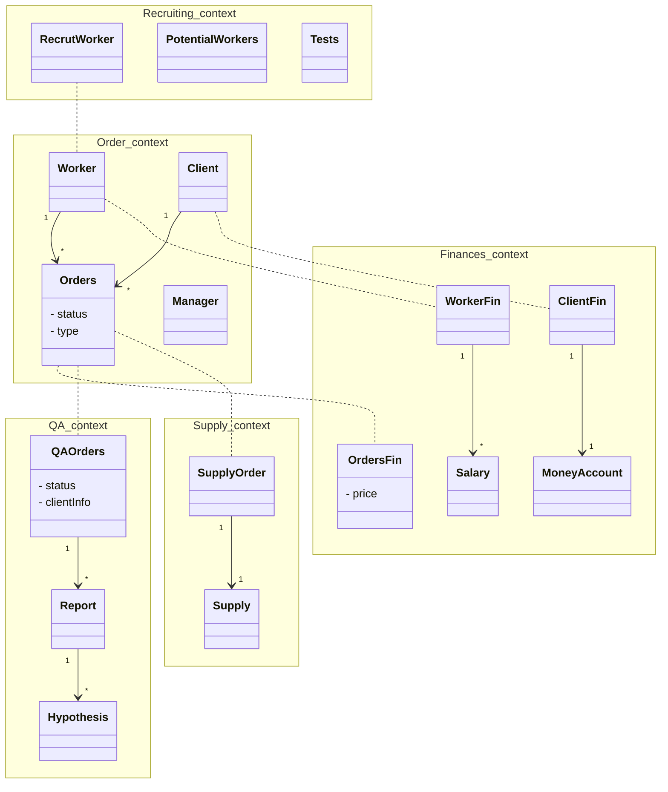

#Homework 1
## ES
[ES miro](https://miro.com/app/board/uXjVNLhcLgU=/?share_link_id=701669159796)
У меня получилось выделить основной контекст - сам процесс заказа. Остальные фичи системы, кажется, без больших проблем могут существовать +- автономно. Получается большая связность с финансами, но я посчитал, что их все-таки можно выделить в отдельный контекст.

## Модель данных
*Тут я уже торопился:)*

	.... : одни и те же данные 
	1 -> * : соотношение 1 к многим
	1 -> 1 : 1 к 1

Процесс заказа больше всего насыщен данными, в остальные контексты уже требуются лишь часть данных из процесса заказа. Например, для проверки проваленных заказов нужна информация о конкретном заказе и возможно данные клиента.
[](https://mermaid.live/edit#pako:eNp9VE1rwzAM_SvBx9EOdu1hUDb2cShb28EugaE5amfm2MZWYKH0v8-1kzZxkuYSofcsPT0LHxjXBbIF4xKcexSwt1DmKvOfghKdAY7Zmy3QfnGtCP8oO0T49IVDEXbdfDbPHAFVrpei2uAlcUzLrEDBHm2W5j-1_R1JP0iBipq0LxaDlszucpbN5_c-uvFRlBgp7cEJSjr8k1CgOLrp-WNBzxtXPgLEXh7omRZMMlbwqy5phfWSc10pSrEtSLB14khzO7e3l649qzyQ6GwM8kAy2Zk3MK_b-XyoxzpFfe2p0evltMXr5ciSje9ZyPKg4VXt9BUrN2i0pcFivdRG0w864SadbOXE_FlcOm9sEElts8S4brPUkG1ljKynTYl46D0OTeofnOwkBlO0tVJ5G-S2EiTUflpi4FDcmxR71-TvSICMsEvxD3SUXkG33mVzh9qeofyWV5UFBnYsGLGpx2EzVqItQRT-tQzlcuZvrsScLXxY4A4qSTnL1dFToSK9rRVnix1IhzNWmQIImwf2nMVCkLar5gk-_Y7_NOKz1g)

mermaid диаграмма

## To be done :(

